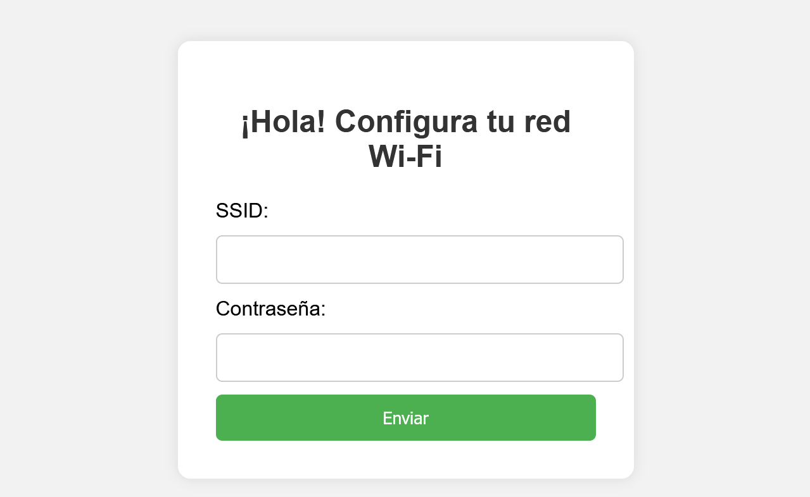
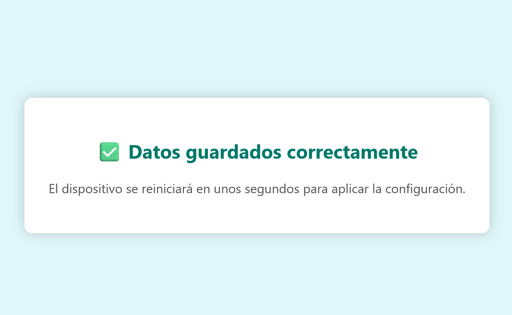
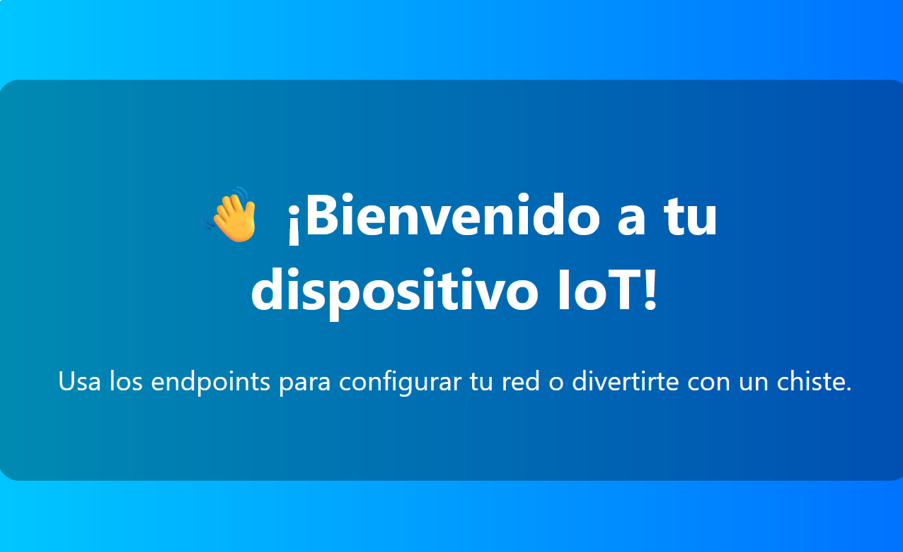
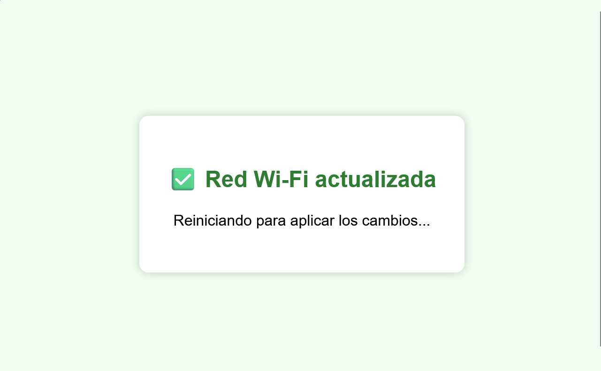
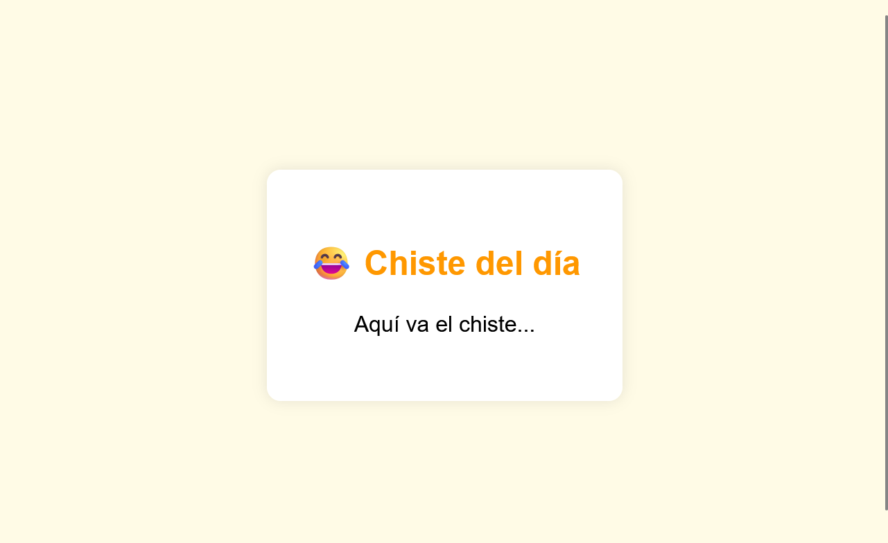

### **Imagen 1: Formulario de Configuración Wi-Fi**

**Descripción:**
Esta vista se presenta cuando el ESP32 está en modo Access Point (AP) o cuando el usuario desea cambiar la red Wi-Fi. Contiene un formulario HTML con dos campos:

- **SSID**: nombre de la red Wi-Fi.
- **Contraseña**: clave de acceso.

**Funcionalidad:**
Al enviar el formulario, los datos se guardan en la memoria no volátil del ESP32 y el dispositivo se reinicia para aplicar la configuración.

---

### **Imagen 2: Confirmación de Configuración Exitosa**

**Descripción:**
Después de enviar el formulario de configuración, esta vista muestra un mensaje de éxito indicando que las credenciales fueron guardadas correctamente.

**Contenido:**
- Mensaje de confirmación.
- Indicador visual (✅).
- Aviso de reinicio automático del dispositivo.

---

### **Imagen 3: Página de Bienvenida**

**Descripción:**
Es la página principal del sitio web una vez que el ESP32 está conectado a una red Wi-Fi. Da la bienvenida al usuario y presenta una introducción al sistema.

**Funcionalidad:**
Desde esta página se puede acceder a los diferentes endpoints disponibles, como cambiar la red o ver un chiste.

---

### **Imagen 4: Cambio de Red Wi-Fi Exitoso**

**Descripción:**
Esta vista aparece después de usar el endpoint `/change_wifi` para actualizar las credenciales de red.

**Contenido:**
- Mensaje de éxito.
- Aviso de reinicio para aplicar los cambios.

---

### **Imagen 5: Página del Chiste**

**Descripción:**
Esta vista corresponde al endpoint `/chiste`, que obtiene un chiste aleatorio desde la API JokeAPI.

**Contenido:**
- Título: "😂 Chiste del día".
- Texto del chiste.
- Estilo visual amigable y colorido.

